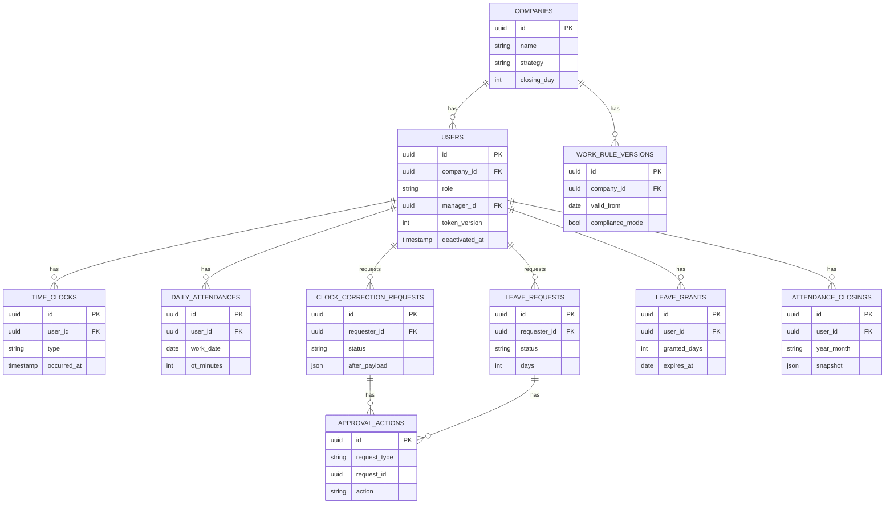

# 勤怠管理システム

[](https://github.com/y0913/attendance-management-system/actions/workflows/ci.yml)

> Next.js (App Router) + Server Actions + Prisma 構成における、業務系システムの設計パターン検証用プロジェクト。労働基準法に準拠した勤怠管理を題材に、effective-dated な履歴管理、pure function による計算ロジック分離、polymorphic-lite な承認ワークフロー、snapshot による整合性担保、ロールベース権限制御の二層構造、companyId スコープによるマルチテナント隔離を実装する。

UI 言語は日本語のみ。シフト勤務・任意締め日などは scope out とし、業務ロジックとセキュリティ設計に集中する。`/` を未認証向けランディングページ、認証済はロール別ホーム（`/admin/dashboard` or `/clock`）に振り分ける構成。

---

## プロジェクトの目的

業務システムでよく登場する「設計上で迷う論点」を、ひとつの題材で網羅的に扱うことを目指す：

- **effective-dated な履歴管理** — 労働ルールのバージョニング
- **pure function による計算ロジックの分離** — DB / Auth に依存しないテスト容易な残業計算
- **polymorphic-lite な承認ワークフロー** — 1 テーブルで複数申請種別を扱う
- **snapshot による整合性担保** — 締め後の月次集計を凍結し、過去ルール変更の影響を遮断
- **ロールベース権限制御** — middleware（粗いガード）+ Server Action（manager_id ベースの細かい認可）の二層構造
- **マルチテナント隔離** — `companyId` スコープを data 層 + page 層の二段で適用し、クロステナント漏れを排除
- **セキュリティの多層防御** — Magic link 認証、JWT 寿命短縮、nonce-based CSP、tokenVersion による任意ユーザーの強制ログアウト

---

## 主要技術スタック

| カテゴリ | 採用技術 | 採用理由 |
|---|---|---|
| Framework | Next.js 16 (App Router) | Server Components + Server Actions の組み合わせで、フォーム処理のサーバ側完結を実装パターンとして検証 |
| Language | TypeScript (strict) | 型による業務ロジックの担保 |
| Database / ORM | PostgreSQL (Supabase) + Prisma 7 | スキーマファースト、マイグレーションのトレーサビリティ。`@prisma/adapter-pg` driver adapter で接続 |
| Auth | Auth.js (NextAuth) v5 + Nodemailer Provider | Magic link 認証（パスワードレス）、JWT 戦略、role-based middleware による粗ガード |
| Email | Resend (本番) / mailpit (dev) | SMTP 経由。招待メールは NextAuth 互換 token を直接生成して `signIn()` 経由せず送信 |
| Form / Validation | React Hook Form + Zod | クライアント+サーバ両方で同じスキーマを共有 |
| UI | Tailwind CSS + shadcn/ui | ポートフォリオの工数を圧縮しつつ実用 UI を組む |
| Data Table | TanStack Table v8 | 勤怠一覧・申請一覧のソート / フィルタ |
| PDF | @react-pdf/renderer | 月次勤怠表 / 帳票出力。Noto Sans JP をローカル同梱 |
| Date / Time | date-fns + date-fns-tz | JST 固定の時刻計算（CI 環境 TZ への依存排除） |
| Logging | pino | 構造化ログ。`logActionError` から自動で Sentry にも転送 |
| Monitoring | @sentry/nextjs | サーバ / Edge / Browser ランタイム全層をカバー（DSN 未設定なら no-op） |
| Testing | Vitest（unit + integration）/ Playwright（E2E） | 301 + 21 + 3 = 325 件 |
| Deploy | Vercel + Vercel Cron | — |

---

## 機能スコープ概要

| 領域 | 内容 |
|---|---|
| マルチテナント | `companyId` で会社単位にデータ分離。セルフ登録（`/signup`）で会社作成 + admin になる |
| ロール | `admin` / `approver` / `general` の 3 段階 |
| ユーザー追加 | admin が `/admin/employees/new` から追加 → NextAuth 互換 magic link 付き招待メールを自動送信 |
| 勤務形態 | 固定勤務、月末固定締め、正社員月給 / 時給バイト |
| 打刻 | Web ボタン打刻、休憩は手動、打刻修正は申請承認フロー必須 |
| 残業計算 | 労基法準拠（日 8h 超 1.25、深夜 22-5 +0.25、法定休日 1.35、月 60h 超 1.50） |
| 有給 | 法定付与（入社 6 ヶ月後 10 日 → 漸増）、半日有給、FIFO 消化、失効管理 |
| 労働ルール | `work_rule_versions` で会社単位にバージョン管理（effective-dated） |
| 締め処理 | 月次で snapshot 凍結、締め済み月は再計算しない、締め解除も対応 |
| 承認フロー | 打刻修正 / 有給を `approval_actions` 1 テーブルで polymorphic-lite に管理 |
| レポート出力 | 給与 CSV / 月次勤怠表 PDF / 個別勤怠 CSV、BOM 付き UTF-8 で Excel 文字化けなし |
| ランディングページ | 未認証ユーザー向けの `/`、ロール別機能・主要機能・セキュリティ・技術スタックを訴求 |

詳細仕様（テーブル全カラム、画面 IA、残業計算ルール、現在の Phase）は [`CLAUDE.md`](./CLAUDE.md) を参照。

---

## 実装ハイライト

このプロジェクトで意図的に扱う設計パターン：

### 1. 設定駆動の計算ロジック
残業倍率や閾値はコードにハードコードせず、`work_rule_versions` から動的取得する。`getEffectiveRule(companyId, date)` を経由しないルール参照は禁止規約。

### 2. effective-dated な履歴管理
`work_rule_versions` は `valid_from` のみ持ち、`valid_to` は次バージョンの `valid_from` で暗黙定義。過去・現行は閲覧のみ、未来予約のみ編集可能。過去への遡及登録は禁止。

### 3. compliance_mode による法定下限バリデーション
単純なフラグではなく、ON のとき法定下限を下回るルール値を Zod で弾く挙動切替。OFF にすると警告バナー表示で許容（自己責任モード）。

### 4. 月途中ルール変更戦略の A/B 切替
`mid_month_rate_change_strategy: 'daily' | 'month_end'` を会社単位のメタ設定として保持。ルール履歴の中に戦略を持たせると「戦略が月途中で変わったらどう扱うか」という再帰問題が出るため、外側に切り出した。月 60h 超の閾値またぎで挙動差が出る。

### 5. 締め snapshot による整合性担保
`attendance_closings.snapshot` (jsonb) で月次集計を凍結保存。締め済み月は再計算せず、過去ルール変更の影響を遮断する。

### 6. polymorphic-lite な承認アクション設計
`approval_actions (request_type, request_id, ...)` で打刻修正と有給申請を共通管理。完全な polymorphic association は採用せず、SQL レベルで FK が貼れる範囲で割り切り。

### 7. 計算ロジックの単体テスト網羅性
`src/lib/calc/` 配下は pure function に集約し、DB / Auth を持ち込まない。境界条件（閾値ちょうど・+1・-1、月またぎ、日跨ぎ、TZ）を網羅し、branch coverage 90% 以上を目標。

### 8. ロールベース権限制御の二層構造
- **middleware** — ルートレベルのロールガード（admin only ページなど）
- **Server Action** — `manager_id` ベースの細かい認可（自部下チェック）

クライアントから渡された role / userId は信用せず、必ず `session` から取得する。

### 9. 監査ログ
`audit_logs` に before / after JSON で全変更を記録。対象はルール変更、締め / 解除、ロール変更、月途中変更戦略の変更、強制ログアウトなど、業務影響の大きい操作に絞る。

### 10. マルチテナント隔離（defense in depth）
`session.companyId` を session オブジェクトから取得し、data 層の全関数に `(companyId, ...)` で渡す形に統一。集約クエリ（`listAllPending`, `listAuditLogs` 等）は `requester: { companyId }` / `actor: { companyId }` の relation filter で絞り、id 直叩き系（`findCorrectionById`, `findLeaveRequestById`, `findClosingById` 等）は companyId フィルタを必須化。mutation（`updateMockUser`, `decideCorrection` 等）も pre-flight で companyId 一致を確認してから実行。さらに page-level でも URL/form 入力経由の `findMockUserById(id)` 後に `target.companyId !== session.companyId` を確認する二重ガード。

セルフ登録時は transaction で `Company` + admin `User` + 初期 `WorkRuleVersion` を atomic に作成。各訪問者が独立した会社サンドボックスを得る。

### 11. セキュリティの多層防御
- **Magic link 認証** — Nodemailer Provider 経由、Rate limit 付き
- **JWT 寿命 7 日** — `session.maxAge` を明示し、stolen cookie の有効窓を最小化（NextAuth デフォルト 30 日から短縮）
- **Role/deactivation refresh interval 1 分** — JWT callback が DB と同期し、無効化反映の窓を 1 分以内に
- **tokenVersion による任意ユーザーの強制ログアウト** — admin が `/admin/employees/[id]` から「全端末ログアウト」を実行すると、対象ユーザーの `users.token_version` が +1。既存 JWT は次の refresh で version 不一致を検知し無効化される
- **nonce-based Content Security Policy** — リクエスト毎に `crypto.randomUUID()` の nonce を発行、`x-nonce` リクエストヘッダで Next.js renderer に伝搬。本番は `script-src 'self' 'nonce-XXX'` の厳格モード、dev は Turbopack HMR との互換性のため緩和
- **CSRF / Clickjacking / MIME sniffing 対策** — SameSite=Lax cookie、Server Action Origin 検証、`X-Frame-Options: DENY`、`frame-ancestors 'none'`、`X-Content-Type-Options: nosniff`、`Referrer-Policy: strict-origin-when-cross-origin`
- **メアド列挙対策** — `signInAction` で未登録/無効メアドでも `/login?verify=1` にリダイレクトし、レスポンスから判別不能化

### 12. NextAuth 互換 token を直接生成する招待メール
admin が従業員を追加すると `sendInvitationEmail` を自動発火する。NextAuth の `signIn()` は admin 自身のセッションを redirect で巻き込むため使えず、代わりに `@auth/core/lib/utils/web.js` と同じハッシュアルゴリズム（`SHA256(token + AUTH_SECRET)`）で `verification_tokens` を直接 insert。生成 URL `${AUTH_URL}/api/auth/callback/nodemailer?...` をクリックすると NextAuth の通常コールバックを通って `/clock` に着地する。招待用に件名・本文（会社名 / 招待者名 / ロール明示）を差し替え。

### 13. ランディングページ（未認証向け）
`/` は ヒーロー / 3 つの価値 / ロール別機能 / 主要機能 / セキュリティ / 技術スタック / Final CTA / Footer の 8 セクションで構成。Server Component のみ、`/signup` への CTA を主導線とする。セキュリティ訴求は「具体的な実装詳細は伏せ、概念のみ」のポリシーで攻撃者へのヒントを最小化（タイミング / 期間 / 機構名は載せない）。

---

## ER 図



`audit_logs (entity_type, entity_id, action, actor_id, before, after, created_at)` は全エンティティ横断のため ER 図には含めず、別建て。`daily_notes (user_id, jst_date, body)` も日報用の補助テーブルとして本図からは省略。NextAuth が自動管理する `accounts` / `sessions` / `verification_tokens` も同様に省略。

---

## 設計判断のメモ

- **計算ロジックは pure function に集約** — DB / Auth に依存させない。テスト容易性と再利用性を優先
- **compliance_mode は単純トグルではなくバリデーションのスイッチ** — 法定下限を下回る値を Zod で弾く挙動を切り替える設計
- **月途中変更戦略は履歴の外に出す** — 履歴に戦略を持たせると再帰問題が発生するため、会社単位のメタ設定として外側に切り出し
- **打刻はイベントベース + 集計キャッシュの二層構成** — `time_clocks`（生イベント）と `daily_attendances`（再計算可能な集計キャッシュ）を分離。打刻修正は前者を新規追加、後者を再計算
- **締め後の集計は snapshot で凍結** — 過去ルール変更の影響を遮断
- **承認は polymorphic-lite** — 完全な polymorphic association ではなく、`request_type` + `request_id` の二列で十分割り切る
- **`session.companyId` は DB の真実から派生** — JWT に焼き込まず、毎回 `getMockSession()` で DB から取り直す。`React.cache` でリクエスト内 1 回に圧縮。マルチテナント詐称はそもそも不可能な構造
- **id を取る data 層関数は全て companyId 必須** — 引数で明示的に渡す。アンビエントスコープ（隠れた session 参照）は使わない。テスト時の依存が明確になり、単体テストで pure 引数チェックができる
- **JWT 個別失効は tokenVersion で代替** — DB session strategy への切替はコスト高なので、JWT に焼き込んだ `tokenVersion` と DB の値を refresh 時に照合する方式を採用。完全 stateless 性とは妥協するが、最大 1 分の窓を許容して個別ログアウトを実現
- **CSP の dev/prod 二態** — 本番は nonce ベースで厳格、dev は `'unsafe-inline' 'unsafe-eval'` に緩和。dev で nonce を強要すると Turbopack HMR の動的 inline script が CSP で弾かれてフルリロード loop に陥るため、明示的に分岐

---

## セットアップ

```bash
# 依存インストール
npm install

# 環境変数
cp .env.example .env
# DATABASE_URL / DIRECT_URL / AUTH_SECRET / EMAIL_SERVER_* / EMAIL_FROM などを設定
# dev では mailpit (`docker compose up -d`) と組み合わせて magic link を確認可能

# Prisma クライアント生成
npm run prisma:generate

# マイグレーション
npm run prisma:migrate

# 開発サーバー
npm run dev
```

---

## 開発コマンド

| コマンド | 用途 |
|---|---|
| `npm run dev` | 開発サーバー（http://localhost:3000） |
| `npm run build` | 本番ビルド |
| `npm run lint` | ESLint |
| `npm run typecheck` | tsc --noEmit |
| `npm run format` | Prettier 整形 |
| `npm run format:check` | Prettier チェック |
| `npm run test` | Vitest 単体テスト |
| `npm run test:coverage` | カバレッジ付きテスト |
| `npm run db:test:setup` | Integration / E2E 用 test DB の作成 + マイグレーション |
| `npm run test:integration` | Integration テスト（実 Postgres 使用） |
| `npm run test:e2e` | Playwright E2E（dev server を別 port で起動、mailpit 経由でログイン） |
| `npm run prisma:generate` | Prisma Client 生成 |
| `npm run prisma:migrate` | マイグレーション実行（dev） |
| `npm run prisma:studio` | Prisma Studio 起動 |

---

## CI

`.github/workflows/ci.yml` で 3 種のテストスイートを並列実行する：

| Job | 内容 | 依存 |
|---|---|---|
| `lint-and-unit` | ESLint / `tsc --noEmit` / Vitest 単体 (301 ケース) | なし |
| `integration` | Postgres service 上で `prisma migrate deploy` → `vitest --config vitest.config.integration.ts` (21 ケース) | `lint-and-unit` |
| `e2e` | Postgres + mailpit service 上で Playwright（chromium、3 ケース）を実行。失敗時は `playwright-report/` を artifact 化 | `lint-and-unit` |

**ローカルで integration / e2e を回すとき**

1. `docker compose up -d` で Postgres と mailpit を起動
2. `.env.test.example` をコピーして `.env.test` を作成
3. `npm run db:test:setup` で `ams_test` DB を作成 + マイグレーション
4. `npm run test:integration` または `npm run test:e2e`

CI 環境では `services:` の Postgres が `POSTGRES_DB=ams_test` で初期化済みなので、`SKIP_DB_CREATE=1` を立てて DB 作成 step をスキップする運用にしている。

---

## 運用 / 監視

### Vercel Cron + ヘルスチェック

`vercel.json` で `/api/cron/health` を 1 日 1 回呼ぶ cron を定義済み。役割：

- Supabase Free の自動 pause（7 日アクセスなしで停止）を防止
- DB 疎通監視：失敗時は `logActionError` 経由で Sentry にも送信される

`CRON_SECRET` を Vercel の Environment Variables に登録すれば、Vercel Cron が `Authorization: Bearer $CRON_SECRET` を自動付与する。コード側はこの値と一致しないリクエストを 401 で弾く。

### Sentry（任意）

`@sentry/nextjs` で server / Edge / Browser ランタイムを集約。Next.js 15.1+ の instrumentation 規約に従い、

- `src/instrumentation.ts` — `register()` で runtime に応じて server/edge config を import、`onRequestError` を re-export
- `src/sentry.server.config.ts` / `src/sentry.edge.config.ts` / `src/instrumentation-client.ts` — 各 runtime の init

`SENTRY_DSN`（server/edge）と `NEXT_PUBLIC_SENTRY_DSN`（browser）を設定すると、`logActionError` 経由のエラーと Browser の unhandled rejection / window.onerror を Sentry に送信（`action` を tag、`userId` を user.id、`extra` を context として付与）。

未設定だと初期化も送信もスキップされる（dev / portfolio 自宅運用での余計な送信を防ぐ）。

---

## ディレクトリ構造

```
src/
├── app/
│   ├── layout.tsx            # ルートレイアウト
│   ├── page.tsx              # ランディングページ（未認証向け）
│   ├── icon.tsx              # 動的 favicon（ImageResponse）
│   ├── error.tsx / not-found.tsx / loading.tsx / globals.css
│   ├── login/                # magic link 認証
│   ├── signup/               # 会社登録 + admin 作成
│   ├── clock/                # 打刻ホーム
│   ├── attendance/           # 自分の勤怠（月次 + 日次詳細）
│   ├── applications/         # 自分の申請（一覧 + 新規）
│   ├── leave-balance/        # 有給残数 + 付与履歴
│   ├── team/                 # 承認者向け（部下勤怠 / 承認）
│   ├── admin/                # 管理者向け（ダッシュ / 従業員 / 勤怠一覧 / 承認 / ルール / 会社設定 / 締め / 36協定 / レポート / 監査ログ）
│   └── api/
│       ├── auth/[...nextauth]/   # NextAuth ハンドラ
│       ├── admin/reports/        # 給与 CSV / 個別勤怠 CSV / 月次勤怠表 PDF
│       └── cron/health/          # Supabase pause 防止 + DB 疎通監視
├── components/
│   ├── app-header.tsx        # ロール別ナビ（admin は 3 dropdown）
│   ├── nav-dropdown.tsx      # <details> ベースの軽量 dropdown（client）
│   ├── pagination.tsx
│   └── ui/                   # shadcn/ui コンポーネント
├── lib/
│   ├── auth/
│   │   ├── guards.ts         # requireAdmin / requireApprover
│   │   ├── invitation.ts     # NextAuth 互換 token を直接生成する招待メール
│   │   ├── policies.ts       # canDecideRequest 等の pure 認可関数
│   │   └── rate-limit.ts     # magic link の連投ブロック
│   ├── data/                 # Prisma 経由のリポジトリ層（companyId スコープ徹底）
│   │                         #   users / companies / work-rule-versions / time-clocks /
│   │                         #   clock-corrections / leave-requests / leave-grants /
│   │                         #   attendance-closings / attendance-summary /
│   │                         #   approval-actions / audit-logs / pending-approvals /
│   │                         #   overtime-alerts / payroll-bridge / daily-notes /
│   │                         #   session / seed-*
│   ├── calc/                 # 勤怠計算ロジック（pure function）
│   │                         #   daily-attendance / monthly-summary / premium-pay /
│   │                         #   effective-rule / overtime-estimate / leave-grants /
│   │                         #   holidays / weekday-count / constants / types
│   ├── pdf/                  # @react-pdf/renderer（attendance-monthly-pdf + fonts）
│   ├── util/csv.ts           # CSV 生成（BOM + escape）
│   ├── db.ts                 # Prisma Client（driver adapter 経由）
│   ├── db-retry.ts           # withRetry（P2034 / 40001 / 40P01）
│   ├── logger.ts             # pino + Sentry 連携
│   ├── sentry.ts             # 薄いラッパ
│   ├── utils.ts              # shadcn の cn() ヘルパ
│   └── action-result.ts      # Server Action 共通レスポンス型
├── test/                     # 単体テストの共通 fixture / mock setup
├── proxy.ts                  # middleware（auth / CSP / nonce / 静的ファイル素通し）
├── auth.ts                   # NextAuth v5 完全設定（Node runtime）
├── auth.config.ts            # Edge runtime 安全な共有設定
├── instrumentation.ts        # Sentry instrumentation（server/edge ルーティング）
├── instrumentation-client.ts # Sentry browser init
├── sentry.server.config.ts
└── sentry.edge.config.ts
e2e/                          # Playwright テスト（3 ケース）
tests/integration/            # Vitest + 実 Postgres（21 ケース）
prisma/                       # schema.prisma, migrations（4 件）
public/                       # 静的アセット（playwright-logo.svg 等）
```
