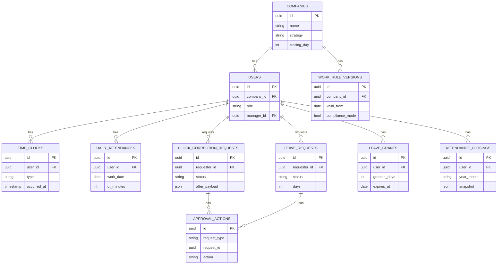

# 勤怠管理システム

[](https://github.com/y0913/attendance-management-system/actions/workflows/ci.yml)

> Next.js (App Router) + Server Actions + Prisma 構成における、業務系システムの設計パターン検証用プロジェクト。労働基準法に準拠した勤怠管理を題材に、effective-dated な履歴管理、pure function による計算ロジック分離、polymorphic-lite な承認ワークフロー、snapshot による整合性担保、ロールベース権限制御の二層構造を実装する。

UI 言語は日本語のみ。マルチテナント化・シフト勤務・任意締め日などは scope out とし、業務ロジックの設計に集中する。

---

## プロジェクトの目的

業務システムでよく登場する「設計上で迷う論点」を、ひとつの題材で網羅的に扱うことを目指す：

- **effective-dated な履歴管理** — 労働ルールのバージョニング
- **pure function による計算ロジックの分離** — DB / Auth に依存しないテスト容易な残業計算
- **polymorphic-lite な承認ワークフロー** — 1 テーブルで複数申請種別を扱う
- **snapshot による整合性担保** — 締め後の月次集計を凍結し、過去ルール変更の影響を遮断
- **ロールベース権限制御** — middleware（粗いガード）+ Server Action（manager_id ベースの細かい認可）の二層構造

---

## 主要技術スタック

| カテゴリ | 採用技術 | 採用理由 |
|---|---|---|
| Framework | Next.js (App Router) | Server Components + Server Actions の組み合わせで、フォーム処理のサーバ側完結を実装パターンとして検証 |
| Language | TypeScript (strict) | 型による業務ロジックの担保 |
| Database / ORM | PostgreSQL (Supabase) + Prisma | スキーマファースト、マイグレーションのトレーサビリティ |
| Auth | Auth.js (next-auth) v5 | role-based middleware による粗ガードを最小実装で実現 |
| Form / Validation | React Hook Form + Zod | クライアント+サーバ両方で同じスキーマを共有 |
| UI | Tailwind CSS + shadcn/ui | ポートフォリオの工数を圧縮しつつ実用 UI を組む |
| Data Table | TanStack Table v8 | 勤怠一覧・申請一覧のソート / フィルタ |
| PDF | @react-pdf/renderer | 月次勤怠表 / 帳票出力 |
| Date / Time | date-fns + date-fns-tz | JST 固定の時刻計算（CI 環境 TZ への依存排除） |
| Testing | Vitest（unit）/ Playwright（E2E） | 計算ロジック中心の単体テスト + ロール別 E2E |
| Deploy | Vercel | — |

---

## 機能スコープ概要

| 領域 | 内容 |
|---|---|
| ロール | `admin` / `approver` / `general` の 3 段階 |
| 勤務形態 | 単一会社、固定勤務、月末固定締め、正社員月給 / 時給バイト |
| 打刻 | Web ボタン打刻、休憩は手動、打刻修正は申請承認フロー必須 |
| 残業計算 | 労基法準拠（日 8h 超 1.25、深夜 22-5 +0.25、法定休日 1.35、月 60h 超 1.50） |
| 有給 | 法定付与（入社 6 ヶ月後 10 日 → 漸増）、FIFO 消化、失効管理 |
| 労働ルール | `work_rule_versions` で会社単位にバージョン管理（effective-dated） |
| 締め処理 | 月次で snapshot 凍結、締め済み月は再計算しない |
| 承認フロー | 打刻修正 / 有給を `approval_actions` 1 テーブルで polymorphic-lite に管理 |

詳細仕様（テーブル全カラム、画面 IA、残業計算ルール、現在の Phase）は [`CLAUDE.md`](./CLAUDE.md) を参照。

---

## 実装ハイライト

このプロジェクトで意図的に扱う設計パターン：

### 1. 設定駆動の計算ロジック
残業倍率や閾値はコードにハードコードせず、`work_rule_versions` から動的取得する。`getEffectiveRule(companyId, date)` を経由しないルール参照は禁止規約。

### 2. effective-dated な履歴管理
`work_rule_versions` は `valid_from` のみ持ち、`valid_to` は次バージョンの `valid_from` で暗黙定義。過去・現行は閲覧のみ、未来予約のみ編集可能。過去への遡及登録は禁止。

### 3. compliance_mode による法定下限バリデーション
単純なフラグではなく、ON のとき法定下限を下回るルール値を Zod で弾く挙動切替。OFF にすると警告バナー表示で許容（自己責任モード）。

### 4. 月途中ルール変更戦略の A/B 切替
`mid_month_rate_change_strategy: 'daily' | 'month_end'` を会社単位のメタ設定として保持。ルール履歴の中に戦略を持たせると「戦略が月途中で変わったらどう扱うか」という再帰問題が出るため、外側に切り出した。月 60h 超の閾値またぎで挙動差が出る。

### 5. 締め snapshot による整合性担保
`attendance_closings.snapshot` (jsonb) で月次集計を凍結保存。締め済み月は再計算せず、過去ルール変更の影響を遮断する。

### 6. polymorphic-lite な承認アクション設計
`approval_actions (request_type, request_id, ...)` で打刻修正と有給申請を共通管理。完全な polymorphic association は採用せず、SQL レベルで FK が貼れる範囲で割り切り。

### 7. 計算ロジックの単体テスト網羅性
`src/lib/calc/` 配下は pure function に集約し、DB / Auth を持ち込まない。境界条件（閾値ちょうど・+1・-1、月またぎ、日跨ぎ、TZ）を網羅し、branch coverage 90% 以上を目標。

### 8. ロールベース権限制御の二層構造
- **middleware** — ルートレベルのロールガード（admin only ページなど）
- **Server Action** — `manager_id` ベースの細かい認可（自部下チェック）

クライアントから渡された role / userId は信用せず、必ず `session` から取得する。

### 9. 監査ログ
`audit_logs` に before / after JSON で全変更を記録。対象はルール変更、締め / 解除、ロール変更、月途中変更戦略の変更など、業務影響の大きい操作に絞る。

---

## ER 図



`audit_logs (entity_type, entity_id, action, actor_id, before, after, created_at)` は全エンティティ横断のため ER 図には含めず、別建て。

---

## 設計判断のメモ

- **計算ロジックは pure function に集約** — DB / Auth に依存させない。テスト容易性と再利用性を優先
- **compliance_mode は単純トグルではなくバリデーションのスイッチ** — 法定下限を下回る値を Zod で弾く挙動を切り替える設計
- **月途中変更戦略は履歴の外に出す** — 履歴に戦略を持たせると再帰問題が発生するため、会社単位のメタ設定として外側に切り出し
- **打刻はイベントベース + 集計キャッシュの二層構成** — `time_clocks`（生イベント）と `daily_attendances`（再計算可能な集計キャッシュ）を分離。打刻修正は前者を新規追加、後者を再計算
- **締め後の集計は snapshot で凍結** — 過去ルール変更の影響を遮断。是正処理（締め解除 → 修正 → 再締め）は scope out
- **承認は polymorphic-lite** — 完全な polymorphic association ではなく、`request_type` + `request_id` の二列で十分割り切る

---

## セットアップ

```bash
# 依存インストール
npm install

# 環境変数
cp .env.example .env
# DATABASE_URL, NEXTAUTH_SECRET, NEXTAUTH_URL を設定

# Prisma クライアント生成
npm run prisma:generate

# マイグレーション
npm run prisma:migrate

# 開発サーバー
npm run dev
```

---

## 開発コマンド

| コマンド | 用途 |
|---|---|
| `npm run dev` | 開発サーバー（http://localhost:3000） |
| `npm run build` | 本番ビルド |
| `npm run lint` | ESLint |
| `npm run typecheck` | tsc --noEmit |
| `npm run format` | Prettier 整形 |
| `npm run format:check` | Prettier チェック |
| `npm run test` | Vitest 単体テスト |
| `npm run test:coverage` | カバレッジ付きテスト |
| `npm run db:test:setup` | Integration / E2E 用 test DB の作成 + マイグレーション |
| `npm run test:integration` | Integration テスト（実 Postgres 使用） |
| `npm run test:e2e` | Playwright E2E（dev server を別 port で起動、mailpit 経由でログイン） |
| `npm run prisma:generate` | Prisma Client 生成 |
| `npm run prisma:migrate` | マイグレーション実行（dev） |
| `npm run prisma:studio` | Prisma Studio 起動 |

---

## CI

`.github/workflows/ci.yml` で 3 種のテストスイートを並列実行する：

| Job | 内容 | 依存 |
|---|---|---|
| `lint-and-unit` | ESLint / `tsc --noEmit` / Vitest 単体 (293 ケース) | なし |
| `integration` | Postgres service 上で `prisma migrate deploy` → `vitest --config vitest.config.integration.ts` | `lint-and-unit` |
| `e2e` | Postgres + mailpit service 上で Playwright（chromium）を実行。失敗時は `playwright-report/` を artifact 化 | `lint-and-unit` |

**ローカルで integration / e2e を回すとき**

1. `docker compose up -d` で Postgres と mailpit を起動
2. `.env.test.example` をコピーして `.env.test` を作成
3. `npm run db:test:setup` で `ams_test` DB を作成 + マイグレーション
4. `npm run test:integration` または `npm run test:e2e`

CI 環境では `services:` の Postgres が `POSTGRES_DB=ams_test` で初期化済みなので、`SKIP_DB_CREATE=1` を立てて DB 作成 step をスキップする運用にしている。

---

## 運用 / 監視

### Vercel Cron + ヘルスチェック

`vercel.json` で `/api/cron/health` を 1 日 1 回呼ぶ cron を定義済み。役割：

- Supabase Free の自動 pause（7 日アクセスなしで停止）を防止
- DB 疎通監視：失敗時は `logActionError` 経由で Sentry にも送信される

`CRON_SECRET` を Vercel の Environment Variables に登録すれば、Vercel Cron が `Authorization: Bearer $CRON_SECRET` を自動付与する。コード側はこの値と一致しないリクエストを 401 で弾く。

### Sentry（任意）

`@sentry/node` で server 側エラーを集約。`SENTRY_DSN` を環境変数に設定すると、`logActionError` 経由のすべてのエラーが Sentry に送信される（`action` を tag、`userId` を user.id、`extra` を context として付与）。

未設定だと初期化も送信もスキップされる（dev / portfolio 自宅運用での余計な送信を防ぐ）。

---

## ディレクトリ構造

```
src/
├── app/                  # App Router（Server Components 中心）
├── lib/
│   ├── db.ts             # Prisma Client シングルトン
│   ├── action-result.ts  # Server Action 共通レスポンス型
│   └── calc/             # 勤怠計算ロジック（pure function）
└── ...
e2e/                      # Playwright テスト
prisma/                   # schema.prisma, migrations
```
